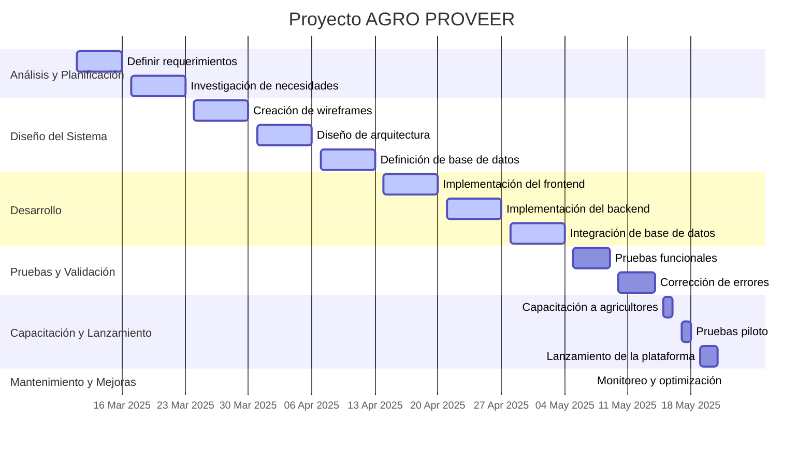

```mermaid
gantt
    title Proyecto AGRO PROVEER
        dateFormat  DD-MM-YYYY
        axisFormat  %d %b %Y
        
        section Análisis y Planificación
        Definir requerimientos           :active, A1, 11-03-2025, 16-03-2025
        Investigación de necesidades      :active, A2, 17-03-2025, 23-03-2025

        section Diseño del Sistema
        Creación de wireframes           :active, B1, 24-03-2025, 30-03-2025
        Diseño de arquitectura           :active, B2, 31-03-2025, 06-04-2025
        Definición de base de datos      :active, B3, 07-04-2025, 13-04-2025

        section Desarrollo
        Implementación del frontend      :active, C1, 14-04-2025, 20-04-2025
        Implementación del backend       :active, C2, 21-04-2025, 27-04-2025
        Integración de base de datos     :active, C3, 28-04-2025, 04-05-2025

        section Pruebas y Validación
        Pruebas funcionales              : D1, 05-05-2025, 09-05-2025
        Corrección de errores            : D2, 10-05-2025, 14-05-2025

        section Capacitación y Lanzamiento
        Capacitación a agricultores      : E1, 15-05-2025, 16-05-2025
        Pruebas piloto                   : E2, 17-05-2025, 18-05-2025
        Lanzamiento de la plataforma     : E3, 19-05-2025, 21-05-2025

        section Mantenimiento y Mejoras
        Monitoreo y optimización         : F1, 22-05-2025, ongoing
```

